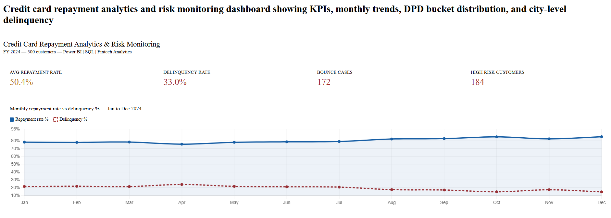
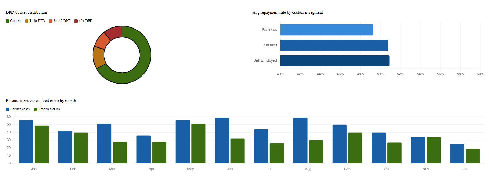
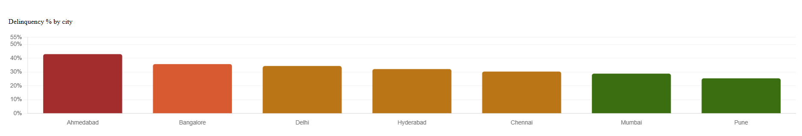

# Credit Card Repayment Analytics & Risk Monitoring


## Overview
This project focuses on repayment analytics and risk monitoring for credit card customers using Python-generated datasets and Power BI dashboards.

The dashboard helps monitor:
- Repayment rates
- DPD bucket analysis
- Bounce cases
- Collection efficiency
- High-risk customer segments

## Business Problem

Financial institutions need real-time visibility into customer repayment behavior, delinquency trends, and collection efficiency to reduce credit risk and improve recovery performance.

## Tools Used
- Python
- Pandas
- NumPy
- Excel/CSV
- Power BI

## Key Features
- DPD Bucket Analysis (0-30, 30-60, 60+)
- Risk Monitoring Dashboard
- Collection Performance Tracking
- Automated Dataset Generation
- Executive KPI Reporting

## Business Impact
- Improved visibility into delinquency trends
- Faster reporting and decision-making
- Better tracking of repayment performance

## Project Structure

```text
credit-card-risk-analytics/
│
├── data/
├── notebooks/
├── dashboard/
├── README.md
```

## Dashboard KPIs
- Total Customers
- Repayment Rate
- Bounce Rate
- Collection Efficiency

## Future Improvements
- SQL database integration
- Real-time dashboard refresh
- Predictive risk scoring

## Dashboard Preview

### Executive Dashboard


### Risk Monitoring Dashboard


### Collection Dashboard


## Key Insights

- Majority of customers fall under the 0-30 DPD bucket
- Bounce rates increase significantly for high-risk customers
- Collection efficiency is lower for customers with repeated payment failures
- Risk segmentation helps prioritize recovery actions


## Author

Juhi Nakhale  
Data Analyst | Power BI | Fintech Analytics
